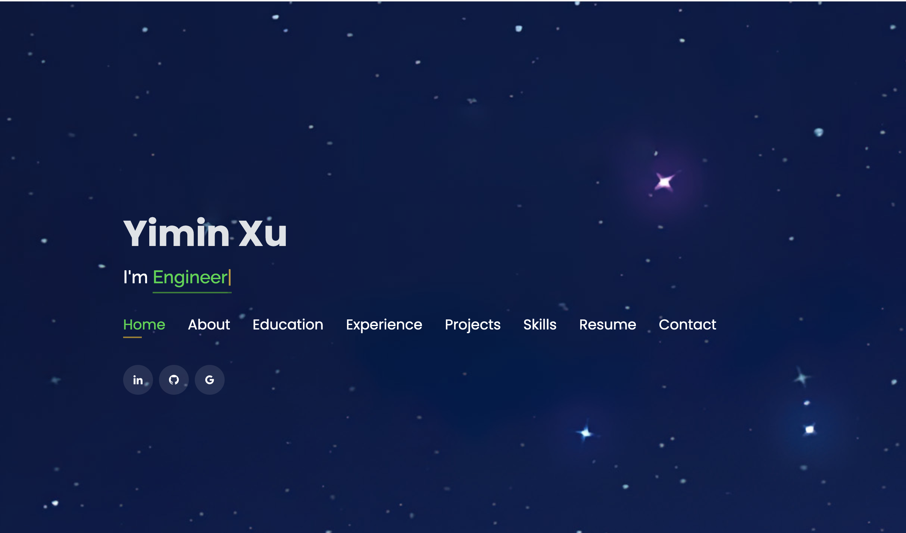

# Personal Portfolio
> https://yiminada.github.io/

:star: Here's my github portfolio. You can quickly know me from this.

### Website Preview

  

## Sections 📚
✔️ About\
✔️ Interests\
✔️ Education\
✔️ Online Certification\
✔️ Experience\
✔️ Projects \
✔️ Skills \
✔️ Resume\
✔️ Contact Info

## Tools Used 🛠️
* <b>GitHub Pages</b> - To host my static website (HTML, CSS, JS).

## Reference
https://github.com/rajaprerak/rajaprerak.github.io

